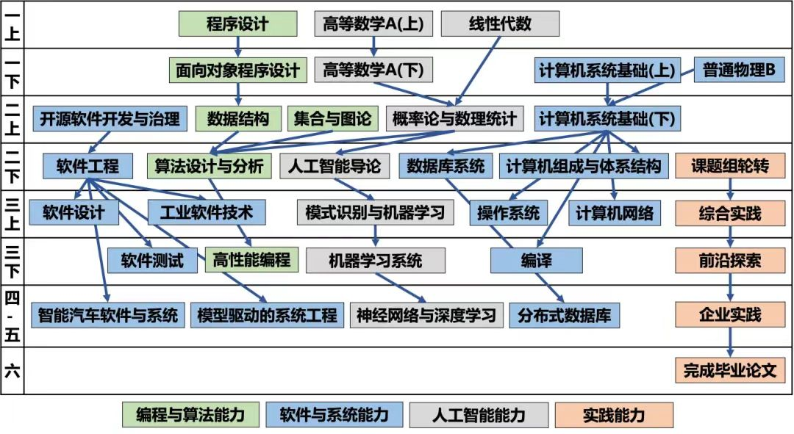
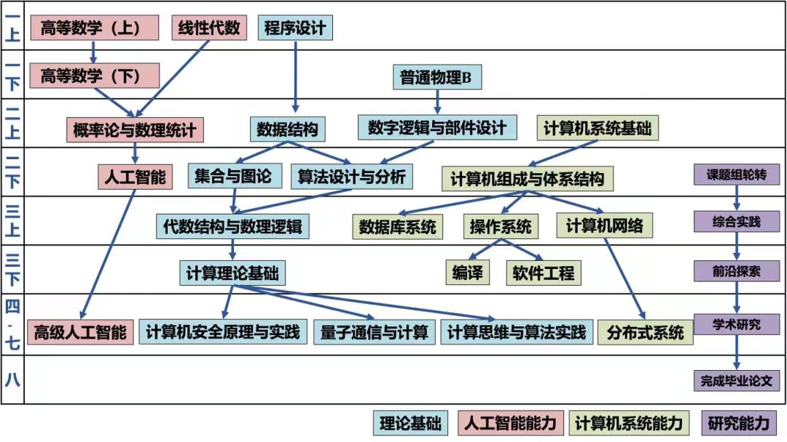

# 计算机and软件工程专业课程体系

25软件工程：参考自复旦大学计算与智能创新学院公众号**计苑菁英**。

以下对课程内容的简介基于作者（23级软件工程学生）的课程体验。

由于同一课程不同教师的内容范围和侧重点有所差别，内容仅供参考。

## 概念大杂烩

- **lab**: 即laboratory，指编程小作业，通常自成体系，针对某一块知识编写代码，完成某个目标。

- **pj**: 即project，指编程大作业，通常涉及内容比较广泛。

也有部分课程只有lab没有pj，则lab就是该课程的编程作业。

- **黑皮书**: 机械工业出版社出版的一系列计算机专业教材，难度较大、内容广泛，部分专业课采用该类书籍及其知识体系。

- **考研408**: 408是计算机统考考试的代码，包括数据结构、计算机网络、操作系统、计算机组成原理四门课程。

- **markdown**: 是一种编写文档的格式，可以使用Typora等软件编写。因为方便编写、格式比较美观，所以在计算机相关专业广泛使用。本网站（freshdan）就是用markdown编写的。

例如用左右各两个星号 `*` 包围可以加粗一些文本：`**被加粗了**`  -> **被加粗了**

- **LaTeX**: 是另一种通过代码实现排版的格式，一般用于撰写规范的计算机专业论文，也可以嵌套在markdown中插入一些公式。

例如在markdown中插入左边这个LaTeX代码会有右边的效果：`$\alpha^{\beta}$` -> $\alpha^{\beta}$

## 大一上

!>以下“对应的知名公开课”并不意味着学习了相关公开课就可以跳过课内课程的学习，而是 [可以从不同老师、不同角度加深认识或作为补充](./self-learning?id=看前必读) 。这些公开课可以搜索找到、而且可能在 [bilibili](https://www.bilibili.com/) 有课程视频翻译。它们通常提供丰富的自学资源，请根据时间精力适当和适量取用。如果需要更加丰富的课程资源介绍，可查阅 [csdiy](https://csdiy.wiki/) 。

### 程序设计

软件工程专业第一门编程课，内容是C语言，涉及C语言基础知识、数组、链表、指针等，侧重于语法和基础的编程作业。

戴开宇老师：以PPT内容为主，课本及其资料供参考。

本课程对于完全没有接触过编程的同学可能会有：“怎么一口气这么多概念”的感觉，并疑惑需不需要“面面俱到”。事实上，由于最重要的各种概念会反复出现，而每一块知识仅仅侧重于某个部分，所以只要循序渐进继续往后学就可以了。

本门课程难度不大，无论是否有信息竞赛基础，都可以从比较传统的角度对C语言以及“编程”有一点了解。

对于有信息竞赛基础的同学，应当已经掌握绝大多数内容。

对应的知名公开课：Harvard CS50，浙大翁恺C语言等。UCB CS61A可以作为完成本课程学习之后在Python语言的进阶补充。

### 高等数学A(上)

大一的第一门数学“硬课”。由数学科学学院开设，内容是单变量微积分。

对应的知名公开课：MIT 18.01

### 线性代数

讲矩阵运算及其性质的，以行列式、矩阵的简单性质为主。

李景涛老师：以同济大学的线性代数课本内容为主，PPT适当补充内容。

在之后的人工智能等课程会用到矩阵运算等内容，需要熟练掌握。

对应的知名公开课：MIT 18.06

## 大一下

### 面向对象程序设计

使用Java语言。

陈辰老师：以lab作业为主，讲解封装、继承、多态。

每年lab作业区别比较大。

对应的知名公开课：UCB CS61B

### 高等数学A(下)

由数学科学学院开设，内容是多变量微积分。

对应的知名公开课：MIT 18.02

### 计算机系统基础(上)

本课程讲解课本为CSAPP，内容有一定难度，尤其是lab作业。

CSAPP是一本著名的计算机专业书籍，中文翻译名叫深入理解计算机系统，机械工业出版社出版。

该课程的部分知识会在后续多门课程用到。

ps. 24级软件工程及其之前的计算机系统基础为一学期课程、共计5个lab。25级及其之后改为两学期课程，可能会增加内容。

对应的知名公开课：CMU 15-213

### 普通物理B

高中物理延伸，增加了微积分的应用。

## 大二上

### 开源软件开发与治理

?

0个人上过这门课。

### 数据结构

讲数据结构的

对应的知名公开课：UCB CS61B

### 集合与图论

一半讲离散一半讲图论

对应的知名公开课：UCB CS70

### 概率论与数理统计

讲概率论和数理统计的

对应的知名公开课：UCB CS70（基础），UCB CS126（进阶） 或 MIT 6.042J

### 计算机系统基础(下)

介绍同 [计算机系统基础(上)](./cs?id=计算机系统基础上) 。

对应的知名公开课：CMU 15-213

## 大二下

### 软件工程

讲软件工程的

### 算法设计与分析

讲算法的

### 人工智能导论

讲人工智能的

### 数据库系统

讲关系数据库设计的

### 计算机组成与体系结构

讲流水线、缓存、分支预测的

## 大三上

### 软件设计

讲设计模式的

### 工业软件技术

### 模式识别与机器学习

### 操作系统

### 计算机网络

讲自顶向下五层网络栈的

## 大三下

### 软件测试

### 高性能编程

### 机器学习系统

### 编译

## 大四

### 智能汽车软件与系统

### 模型驱动的系统工程

### 神经网络与深度学习

### 分布式数据库

25cs：

